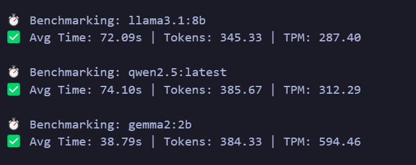
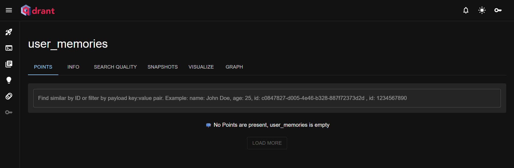

1. Local LLM setup
   We need to precisely determine whether it is beneficial running a local model. We want to create a benchmarking code to determine what open-sourced models can the machine run and with what approximate latency (tpm) - Llama 3.1 8B, Qwen 2.5, Gemma 2B. This benchmarking code preferable should be efficient and not take too much computing resources and should give as accurate answers as possible.

--> 

2. Long term memory for LLMs
   We need to create a memory storage and retrieval agent which works with OpenAl APIs to help give GPT long term memory. This system must record memory (efficiently) for messages in a conversation (whichever ones applicable), for example, "a memory" must be created when a user says, "I use Shram and Magnet as productivity tools". Later, when the user asks, "What are the productivity tools that I use" in a new conversation, GPT should be able to answer, "You use Shram and Magnet". Just like addition, this system should also be able to delete memories when the user says things like "I don't use Magnet anymore”.

--> I tried using openai but apikeys are paid so i switched to Llama.
To enable long-term memory capabilities in GPT-like systems, I implemented a memory storage and retrieval agent using Qdrant and Ollama. I began by designing a Flask-based API that allows adding, querying, and deleting memory snippets based on user input.
To move away from OpenAI’s hosted embedding APIs and ensure cost-effective, local vector generation, I integrated Ollama’s nomic-embed-text model for generating semantic embeddings. I pulled and ran the model locally, replacing cloud-based embedding generation with fast and private on-device inference.
Since Qdrant collections require vector dimensional consistency, I reconfigured the system to align with the 768-dimensional vectors returned by nomic-embed-text. I modified the collection creation logic to dynamically match the model’s output size and ensured robust handling of memory addition, deletion, and semantic search.
To ensure transparency and validation of vector data, I explored collection inspection through Qdrant UI and added diagnostic endpoints to review stored memories programmatically.
Through this, I’ve built a fully local, self-contained memory system capable of recording user preferences, querying via natural language, and deleting obsolete facts, just like how GPT would simulate long-term memory in a real assistant setup.

query 1 : Post req on http://localhost:5000/add_memory

```
Body json - {
    "user_id": "aditya",
    "memory": "I use Shram and Magnet as productivity tools"
}
```

.png>)

.png>)

Query 2 : Query 2 : Post req on http://localhost:5000/query_memory

```
Body json - {
    "user_id": "aditya",
    "query": "What are my productivity tools?"
}
```

.png>)

Query 3 : post req with http://localhost:5000/delete_memory

```
Body json - {
  "user_id": "aditya",
  "text": "I don't use Magnet anymore"
}
```

.png>)


